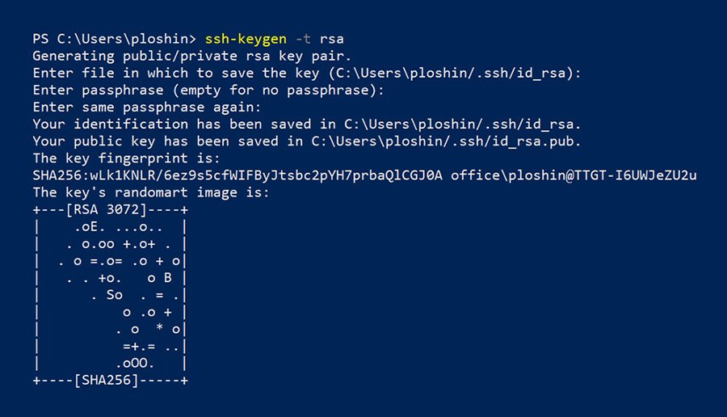

# Setting up git and GitHub

1. Create an account at [GitHub Account](https://github.com/signup) using your education email. {first.last}@education.nsw.gov.au
1. Verify the account with the the email that github will send you.
1. Install the git command line client that matches your OS from [git cli](https://www.git-scm.com/downloads)
1. Install the [GitHub Desktop](https://desktop.github.com/) to simplify some of the tasks you may need to perform with git and GitHub

## Testing the Setup

Open a terminal/command window and type in the following:
```console
$ git --version
```
This should give you a version number like `git version 2.45.2.windows.1`

If it is not installed you will get an error similar to:
```
-bash: git: command not found
```
```
'git' is not recognized as an internal or external command, operable program, or batch file.
```
You will need to go back to step 3 above and install the git client.  

> [!NOTE]
> Sometimes your paths are not updated in your current command line session. To fix this you can try opening a new terminal window and running the same command if you did install it.

## Configuring Git
With Git installed you need to configure it to add information to commits. `git config` gives you the ability to set the required information. First add your username and email address.

```console
git config --global user.name "Your Name"
git config --global user.email "youremail@education.nsw.edu.au"
```

To confirm these are configured type:
```console
git config --list
```
Within the output you should see:
```
user.name=Your Name
user.email=youremail@domain.com
```
The same information is available in your home directory. 
```
~/.gitconfig
```
> [!TIP]
> `~` "tilde" is a shortcut to your home directory on Windows, macOS and Linux from the command line

## Github Configuration
Using the secure shell protocol (SSH) is a safe way to send commands to a computer over an unsecured network. Using an SSH key is a convenient way to access your GitHub account without needing to remember your password.

1. Generate an RSA key pair. This will create a public key file name `.ssh/id_rsa.pub`
    - accept the defaults
    - ensure you use a passphrase and store it somewhere safe. 
> [!TIP]
> I recommend [keepassXC](https://keepassxc.org/) as it stores passwords in an encrypted file locally, works on the main OSes and has an extension for your browser.

```console
$ ssh-keygen -t rsa
```

