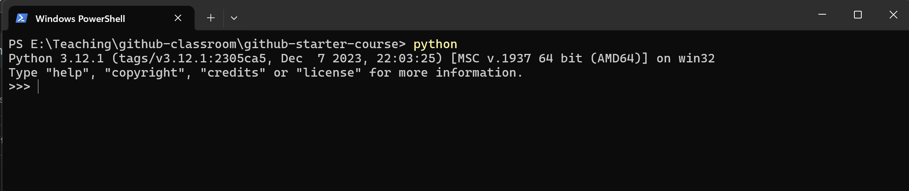

From the command line change to your directory for this subject. See below for a tip on organising you folders on your computer.

```console
foo@bar:~$ python
```
This will start python in an interactive shell where you can type code.



Try a few commands:
```
 5 + 6
 6+3*4
 (6*3)+4
 print("hello")
 repr("hello")
 dir("hello")
```

As you can see you can use the shell for calculations and also calling built in methods.

> **QUESTION**<br>
> 1. Research why the 3 commands above give you different results and what is the purpose of `repr` and `dir`

> **EXTENSION**<br>
> 1. Create code that spans multiple lines to solve the problem `sum the number 5, 4, 3 and print out the result as:`<br> `5+4+3 = 12`

>[!Tip]
> I recommend you organise your folders on your machine to be 1 per subject and grouped per stage

```
highschool
├── 2024
|   ├── English
|   ├── Geography
│   └── ...
|
├── 2025
|   ├── ...
│   └── ...
| ...

or 

highschool
├── stage5
│   ├── ComputingTechnology
│   └── ...
|
├── stage6
│   ├── SoftwareEngineering
│   ├── EnterpriseComputing
│   └── ...
└── ...```

